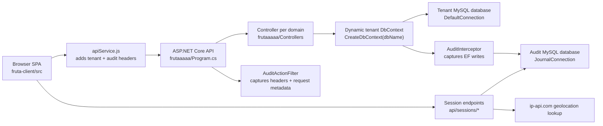

# Fruta Codebase

## What this project is

Fruta is a multi-screen fruit operations application with a React 19 SPA frontend and an ASP.NET Core 8 Web API backend backed by MySQL. It manages daily export programs, dashboard analytics, treatments, defects, direct ecarts, vente ecart flows, quality sample follow-up, brand assignments, and adherent decompte/advance calculations.

The system is tenant-aware in a lightweight way: the user chooses a database name at login, the frontend stores it in `sessionStorage`, and almost every API request sends it through `X-Database-Name`. Controllers then build a fresh `ApplicationDbContext` against that tenant database by string-replacing `frutaaaaa_db` in the base connection string.

## Architecture



## Exact stack

- Backend runtime: ASP.NET Core targeting `net8.0` in `frutaaaaa/frutaaaaa.csproj`
- Local SDK present in this workspace: `.NET SDK 9.0.306`
- ORM: `Pomelo.EntityFrameworkCore.MySql 8.0.2`
- EF tooling: `Microsoft.EntityFrameworkCore.Tools 8.0.7`
- API docs: `Swashbuckle.AspNetCore 6.6.2`
- Frontend runtime: React SPA in `fruta-client/package.json`
- Installed frontend versions from `fruta-client/package-lock.json`:
  - `react 19.1.0`
  - `react-dom 19.1.0`
  - `react-router-dom 7.6.3`
  - `recharts 3.1.0`
  - `react-select 5.10.2`
  - `rc-slider 11.1.9`
  - `react-draggable 4.5.0`
  - `jspdf 3.0.3`
  - `jspdf-autotable 5.0.2`
  - `html2canvas 1.4.1`
  - `vite 7.1.10`
  - `@vitejs/plugin-react 4.6.0`
  - `eslint 9.30.1`
- Local JS tooling present in this workspace:
  - `node v22.17.0`
  - `npm 10.9.2`
- Database engines:
  - tenant business DB from `ConnectionStrings:DefaultConnection`
  - audit/session DB from `ConnectionStrings:JournalConnection`
- External services and infra:
  - Vercel SPA hosting via `fruta-client/vercel.json`
  - Azure App Service deployment artifacts in `frutaaaaa/Properties/PublishProfiles`
  - `ip-api.com` geolocation calls in `frutaaaaa/Audit/SessionController.cs`
  - hard-coded allowed origins include Vercel, DDNS, ngrok, and `fruta.accesscam.org` in `frutaaaaa/Program.cs`

## Folder ownership

- `/.github/workflows`
  - Present but empty. There is no checked-in CI pipeline.
- `/fruta-client`
  - Frontend app root.
- `/fruta-client/src`
  - Source of truth for SPA code.
- `/fruta-client/src/pages`
  - Route-level screens. Most business behavior lives here.
- `/fruta-client/src/components`
  - Shared layout, charts, modals, and UI helpers.
- `/fruta-client/src/utils`
  - PDF generation, date formatting, number formatting.
- `/fruta-client/public`
  - Static assets used by the SPA.
- `/fruta-client/dist`
  - Generated frontend build output. Do not treat as source.
- `/fruta-client/node_modules`
  - Installed dependencies. Do not edit.
- `/frutaaaaa`
  - ASP.NET Core Web API project root.
- `/frutaaaaa/Controllers`
  - All API endpoints. Most domains use one controller per business area.
- `/frutaaaaa/Data`
  - `ApplicationDbContext` for tenant business data.
- `/frutaaaaa/Audit`
  - Audit/session models, action filter, interceptor, and separate `AuditDbContext`.
- `/frutaaaaa/Models`
  - Entity models, DTOs, request objects, and some SQL reference files.
- `/frutaaaaa/Migrations`
  - Partial EF migrations. Not every table in the system is represented here.
- `/frutaaaaa/Properties`
  - launch settings, publish profiles, service dependency templates.
- `/frutaaaaa/bin`, `/frutaaaaa/obj`
  - Generated backend build output. Do not edit.
- `/create_tables_prod.sql`, `/gestionavances_schema.sql`, `/frutaaaaa/Models/ShelfLifeTables.sql`
  - Manual schema artifacts for domains not fully governed by migrations.
- root zip/rar artifacts and build logs
  - Legacy/generated operational files checked into source control. Ignore unless a task explicitly needs them.

## How data flows

### Login and page authorization

1. `LoginForm.jsx` posts `{ database, username, password, permission: 0 }` to `/api/users/login`.
2. `UsersController.Login` creates a tenant `ApplicationDbContext` for `request.Database`.
3. On success the backend returns `userId`, `database`, and `permissions` only. There is no JWT, cookie, or server-issued session token.
4. The frontend stores the user object in `sessionStorage`.
5. `ProtectedRoute.jsx` uses `user.permissions` to gate routes client-side.
6. The backend does not enforce those page permissions with `[Authorize]` or policy attributes.

### Normal business request

1. A page calls `apiGet/apiPost/apiPut/apiDelete` from `fruta-client/src/apiService.js`.
2. `apiService.js` adds:
   - `X-Database-Name`
   - `X-User-Id`
   - `X-Username`
   - `X-Machine-Name`
   - `ngrok-skip-browser-warning`
3. Controller action receives the request and usually reads `[FromHeader(Name = "X-Database-Name")] string database`.
4. Controller calls its own `CreateDbContext(database)` helper.
5. EF queries the tenant MySQL database.
6. For non-GET requests, `AuditActionFilter` captures request metadata and `AuditInterceptor` writes INSERT/UPDATE/DELETE snapshots into the journal DB.

### Session tracking

1. Login success calls `postSessionStart`.
2. Route changes call `postSessionPage`.
3. Logout or tab close calls `postSessionEnd` or `sendBeaconSessionEnd`.
4. `SessionController` stores rows in `user_sessions` and `user_page_visits`.
5. `StartSession` enriches the session with `ip-api.com` geolocation unless IP is private/loopback.

## Authentication and authorization reality

- Authentication is plain username/password lookup in the selected tenant DB.
- Passwords are stored and compared as plain text in `frutaaaaa/Controllers/UsersController.cs`.
- Authorization is frontend-only page gating using `user.permissions`.
- `Program.cs` calls `app.UseAuthorization()` but there is no authentication scheme and no `[Authorize]` usage.
- Custom headers are trusted for audit identity; they are not cryptographically verified.

Treat this as a fragile legacy security model. Do not accidentally document or build on it as if it were JWT- or cookie-based auth.

## Error handling conventions

- Common backend pattern: `try/catch` then `return StatusCode(500, $"An error occurred: {ex.Message}")`
- Some endpoints return anonymous `{ message = ... }` objects instead of plain strings.
- `SampleController.GetDailyCheck` returns `Ok(null)` on failure instead of `500`.
- Audit and session helpers intentionally fail silently to avoid blocking business actions.
- Frontend pages typically `console.error(...)` and set local UI error state or alert text.
- `apiService.js` unwraps JSON error bodies when available and throws `Error(errorData.message || ...)`.

Never assume consistent error payload shape across endpoints.

## Testing and validation

- No test projects, test files, or browser test setup were found.
- No CI workflow was found under `.github/workflows`.
- Validation is currently manual:
  - `dotnet build` / `dotnet run`
  - `npm run build` / `npm run dev`
  - browser verification against the tenant DB

When changing business logic, add manual verification notes because there is no automated safety net.

## Deployment pipeline

- Frontend:
  - Vercel SPA rewrite in `fruta-client/vercel.json`
  - runtime API base URL comes from `VITE_API_BASE_URL` with fallback `https://localhost:44374`
- Backend:
  - local IIS Express/project launch profiles in `frutaaaaa/Properties/launchSettings.json`
  - folder publish profiles to `\\192.168.1.154\sauvgarde\DEPLOYMENT` and `C:\Users\info\Desktop\DEPLOYMENT`
  - Azure App Service publish profile and ARM template exist, suggesting historic or optional Azure deployment
- Infra reality:
  - deployment is not codified as CI/CD in repo
  - CORS origins are hard-coded in source
  - production connection strings are committed in `frutaaaaa/appsettings.json`, which is a major security smell

## Golden rules

1. Always preserve the tenant database header flow. If a new endpoint skips `X-Database-Name`, it will hit the wrong data source or fail unpredictably.
2. Treat `/fruta-client/dist`, `/fruta-client/node_modules`, `/frutaaaaa/bin`, and `/frutaaaaa/obj` as generated output, not source.
3. Do not “upgrade” auth assumptions in a partial way. Frontend route permissions are not server-side security.
4. Keep audit compatibility for non-GET mutations. New write endpoints should continue sending audit headers from the frontend and saving through EF so the interceptor can run.
5. Be careful with schema changes: some domains are managed by EF migrations, others by standalone SQL files and manual tables.
6. Avoid editing committed secrets/connection strings casually; flag them as risks rather than normalizing them.
7. Preserve response shapes that the existing frontend already expects, especially anonymous JSON casing like `page_name`, `allowed`, `message`, `data`, and `totalPdsfru`.

## Run locally

### Backend

```powershell
dotnet restore .\frutaaaaa\frutaaaaa.csproj
dotnet build .\frutaaaaa\frutaaaaa.csproj
dotnet run --project .\frutaaaaa\frutaaaaa.csproj
```

Default local backend URL from launch settings: `https://localhost:44374`

### Frontend

```powershell
cd .\fruta-client
npm install
$env:VITE_API_BASE_URL='https://localhost:44374'
npm run dev
```

Default Vite dev URL is typically `http://localhost:5173`.

## Which sub-skill to use

- Read `docs/skills/SKILL_auth.md` for login, permissions, sessions, and audit headers.
- Read `docs/skills/SKILL_database.md` for schema ownership, tenant routing, EF mappings, and migrations.
- Read `docs/skills/SKILL_api.md` for controller conventions, endpoint patterns, and request/response shape.
- Read `docs/skills/SKILL_frontend.md` for route structure, state, API usage, and styling patterns.
- Read `docs/skills/SKILL_testing.md` for the current manual validation approach and safe regression checks.
- Read `docs/skills/SKILL_deployment.md` for local run, Vercel, publish profiles, and env/config handling.
- Read `docs/skills/SKILL_error_handling.md` for expected error payloads, logging norms, and failure-tolerant behavior.

## Fragile and legacy areas to flag in any task

- Plaintext DB credentials committed in `frutaaaaa/appsettings.json`
- Plaintext password auth in `frutaaaaa/Controllers/UsersController.cs`
- Client-side-only page authorization in `fruta-client/src/ProtectedRoute.jsx`
- Repeated per-controller `CreateDbContext` helpers instead of a central tenant context factory
- Empty CI directory and no automated tests
- Checked-in generated artifacts and archives at repo root
- Partial schema governance split across EF migrations and ad hoc SQL files
